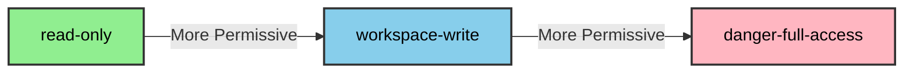
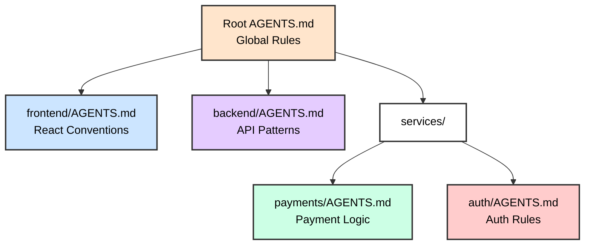
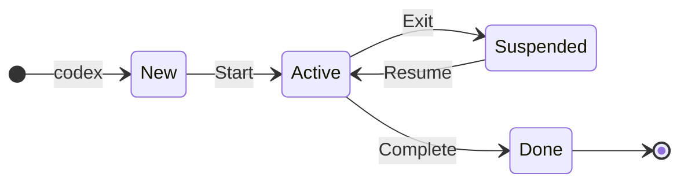
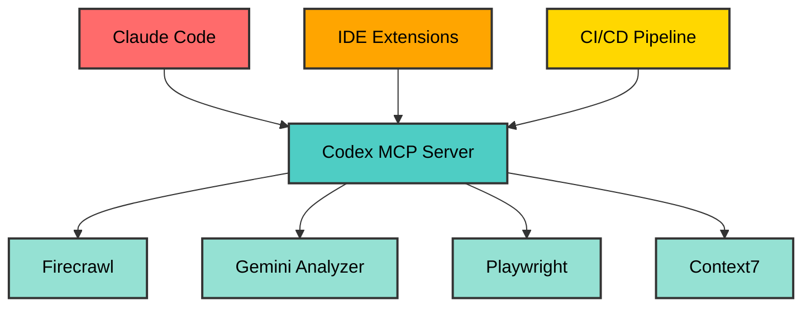

<style>
.slidev-page-num {
  display: block !important;
  opacity: 1 !important;
  visibility: visible !important;
  position: fixed !important;
  bottom: 1rem !important;
  right: 1rem !important;
  z-index: 100 !important;
  color: #666 !important;
  font-size: 0.875rem !important;
}
</style>

# OpenAI Codex CLI Training

## AI-Powered Terminal Coding Agent

<div class="pt-12">
  <span @click="$slidev.nav.next" class="px-2 py-1 rounded cursor-pointer" hover="bg-white bg-opacity-10">
    Press Space for next page <carbon:arrow-right class="inline"/>
  </span>
</div>

---

# Contact Info

Ken Kousen
Kousen IT, Inc.

- ken.kousen@kousenit.com
- http://www.kousenit.com
- http://kousenit.org (blog)
- Social Media:
  - [@kenkousen](https://twitter.com/kenkousen) (twitter)
  - [@kenkousen@foojay.social](https://foojay.social/@kenkousen) (mastodon)
  - [@kousenit.com](https://bsky.app/profile/kousenit.com) (bluesky)
- *Tales from the jar side* (free newsletter)
  - https://kenkousen.substack.com
  - https://youtube.com/@talesfromthejarside

---

# Course Overview

## 5-Hour Hands-On Workshop

<v-clicks>

- Installation and authentication strategies
- Terminal UI and navigation
- Sandbox modes and approval policies
- Real-world coding projects

</v-clicks>

---

# Topics We'll Cover

<v-clicks>

- Advanced TOML configuration
- **Agent Skills** - Reusable workflows (NEW!)
- MCP services integration
- Memory with AGENTS.md
- Custom prompts and profiles
- Multi-model provider support

</v-clicks>

---

# Prerequisites

<v-clicks>

- Command-line experience
- Basic programming knowledge
- Git familiarity
- Docker (for advanced exercises)

</v-clicks>

---

# What is OpenAI Codex CLI?

## Lightweight Terminal-Based Coding Agent

---

# Key Features

<v-clicks>

- Multi-model support (GPT, Claude, Ollama)
- Built-in safety with sandbox modes
- Rich configuration system
- Model Context Protocol (MCP) integration

</v-clicks>

---

# Advanced Capabilities

<v-clicks>

- Session persistence and resumption
- Custom prompts and profiles
- CI/CD compatible
- Headless execution

</v-clicks>

---

# Authentication Options

<v-clicks>

## ChatGPT Account (Recommended)
- Uses existing ChatGPT subscription
- Zero Data Retention (ZDR)
- Simplified login flow

## API Key
- Direct API access
- Pay-per-use pricing
- More configuration required

</v-clicks>

---

# Model Support

<v-clicks>

- <span style="color: #00D4FF">**GPT-5.2-Codex**</span> - Latest, default for API (January 2026)
- <span style="color: #00D4FF">**GPT-5-Codex**</span> - Stable workhorse model
- <span style="color: #00D4FF">**GPT-5-Codex-Mini**</span> - Cost-effective, 4x more usage
- <span style="color: #00D4FF">**GPT-5.1-Codex-Max**</span> - Long-running project-scale work
- Anthropic Claude via API
- Local models via Ollama

</v-clicks>

---

# Installation Methods

```bash
# NPM (recommended)
npm install -g @openai/codex

# Homebrew (macOS/Linux)
brew install --cask codex

# Direct binary download
# Visit: https://github.com/openai/codex/releases
```

---

# Verify Installation

```bash
codex --version
```

---

# Configuration Locations

<v-clicks>

- **Config**: `~/.codex/config.toml`
- **Prompts**: `~/.codex/prompts/`
- **Logs**: `~/.codex/log/`

</v-clicks>

---

# ChatGPT Account Login

```bash
# Interactive login
codex login

# Headless login for servers
codex login --headless
```

---

# API Key Authentication

```bash
# Set environment variable
export OPENAI_API_KEY="your-key"

# Or configure in TOML
echo 'api_key = "your-key"' >> ~/.codex/config.toml
```

---

# Verify Authentication

```bash
codex "Hello, are you working?"
```

---

# Starting Codex

```bash
# Interactive mode (default)
codex

# With initial prompt
codex "explain this codebase"

# Execute and exit mode
codex exec "generate a README"
```

---

# Key Bindings

<v-clicks>

- `Enter` - Submit prompt
- `Ctrl+C` - Cancel current operation
- `Ctrl+D` - Exit Codex
- `Tab` - Autocomplete
- `/` - Access slash commands

</v-clicks>

---

# Slash Commands

<v-clicks>

- `/status` - Show session info & token usage
- `/diff` - Review all pending changes
- `/clear` - Clear conversation history
- `/save` - Save current session
- `/help` - Show available commands
- `/settings` - Adjust runtime settings

</v-clicks>

---

# /diff Command - Review Changes

```diff
--- a/src/main.py
+++ b/src/main.py
@@ -10,7 +10,9 @@ def process_data(input_file):
-    data = json.load(f)
+    with open(input_file, 'r') as f:
+        data = json.load(f)
     return data

3 files changed, 47 insertions(+), 12 deletions(-)
```

Review line-by-line before approving!

---

# /status Command (v0.35+)

Shows comprehensive session information:

```
Current model: gpt-5.2-codex
Session ID: abc123
Token usage: 15,432 / 128,000
Cost estimate: $0.46
Time elapsed: 12m 34s
```

---

# /review Command (v0.76+)

Launch code review without modifying your working tree:

```bash
# Review uncommitted changes
/review

# Review with specific focus
/review Check for security vulnerabilities

# Review changes against a branch
/review Compare with main branch
```

---

# Built-in Reviewers

<v-clicks>

- **Security** - OWASP patterns, injection risks
- **Performance** - N+1 queries, memory leaks
- **Style** - Naming conventions, code structure
- **Tests** - Coverage gaps, edge cases

Reviewers analyze diffs without executing code

</v-clicks>

---

# Search Your Codebase

```bash
# Fast text search with ripgrep
rg "TODO"
rg "authenticate"
rg "database connection"
```

<v-clicks>

- Respects .gitignore and runs fast on large repos
- Pipe matches into Codex for follow-up analysis
- Keep the agent focused by sharing only relevant snippets
- Great starting point for exploration and debugging

</v-clicks>

---

# Web Search Capabilities

```toml
# ~/.codex/config.toml
web_search_request = true
```

<v-clicks>

- Search the entire web for solutions
- Find latest documentation and tutorials
- Access Stack Overflow answers
- Get real-time information
- Research libraries and frameworks

</v-clicks>

---

# Using Web Search

```bash
# In interactive mode, Codex can search the web
codex
> "Search for the latest React 18 features"
> "Find Python async/await best practices"
> "What are the breaking changes in Spring Boot 3?"
```

<v-clicks>

- Automatic web search when needed
- Current information beyond training cutoff
- Verify solutions with official docs

</v-clicks>

---

# Image Inputs

Attach screenshots and design specs for visual context:

```bash
# From command line
codex -i screenshot.png "Explain this error"
codex -i mockup.png "Implement this design"
codex -i diagram.png "Generate code for this architecture"

# Multiple images
codex -i error.png -i logs.png "Debug this issue"
```

---

# Image Input Use Cases

<v-clicks>

- **Debug UI errors** - Share error dialogs, stack traces
- **Implement designs** - Convert mockups to code
- **Analyze diagrams** - Generate from architecture docs
- **Review screenshots** - Identify accessibility issues
- **Compare outputs** - "Why does this look different?"

Paste images directly in the TUI composer!

</v-clicks>

---
layout: image-right
image: https://images.unsplash.com/photo-1555949963-ff9fe0c870eb?ixlib=rb-4.0.3&auto=format&fit=crop&w=1920&q=80
backgroundSize: cover
---

# Core Features

<div class="text-center mt-20">
  <h2 class="text-4xl font-bold text-white bg-black bg-opacity-60 px-6 py-3 rounded-lg">
    Essential Capabilities
  </h2>
  <p class="text-xl text-white bg-black bg-opacity-60 px-4 py-2 rounded mt-4">
    Master the fundamentals
  </p>
</div>

---

# Sandbox Modes



<v-clicks>

- **read-only** - No file modifications
- **workspace-write** - Default; writes limited to the workspace
- **danger-full-access** - No sandboxing (use carefully!)

</v-clicks>

---

# Approval Policies

<v-clicks>

- **untrusted** - Run only trusted commands without prompting
- **on-request** - Approve risky actions
- **on-failure** - Approve only on failures
- **never** - No approval prompts

</v-clicks>

---

# Setting Safety Options

```bash
# Set sandbox mode
codex --sandbox read-only

# Set approval policy (equivalent to approval_policy in config)
codex --ask-for-approval on-request

# Bypass all safety (dangerous!)
codex --dangerously-bypass-approvals-and-sandbox
```

CLI flags override config file settings for the session.

---

# Project Memory: AGENTS.md

## Automatic Context Loading

<v-clicks>

- Place <span style="color: #00D4FF">`AGENTS.md`</span> in project root
- Loaded automatically with first prompt
- Configurable size limit (default: 32KB)

</v-clicks>

---

# Example AGENTS.md

```markdown
# Project: E-Commerce Platform

## Tech Stack
- Backend: Node.js + Express
- Database: PostgreSQL
- Frontend: React + TypeScript
```

---

# AGENTS.md Best Practices

```markdown
## Conventions
- Use async/await for all async operations
- Follow RESTful API patterns
- Write tests for all new features

## Current Focus
Working on payment integration with Stripe
```

---

# Hierarchical AGENTS.md (v0.39+)



Rules cascade: Subfolder overrides parent

---

# Context Cascade Benefits

<v-clicks>

- Global rules apply everywhere
- Subfolder rules override parent
- Each team owns their conventions
- Frontend/backend stay independent
- Microservices maintain autonomy

</v-clicks>

---

# Custom Prompts

## Creating Custom Prompts

<v-clicks>

1. Create `.md` file in `~/.codex/prompts/`
2. Access via slash commands
3. Reusable across projects

</v-clicks>

---

# Example Custom Prompt

```markdown
# ~/.codex/prompts/refactor.md
Refactor the selected code following these principles:
1. Extract complex logic into small functions
2. Use meaningful variable names
3. Add appropriate error handling
```

---

# Prompt Library Highlights

<v-clicks>

- Prebuilt prompts live in `~/.codex/prompts/` (see repo `prompts/README.md`)
- Core templates: `refactor`, `security-audit`, `test-gen`, `pr-review`, `api-upgrade`, `perf-fix`
- Customize or fork them for your team’s workflow and slash commands

</v-clicks>

```bash
/refactor
/security-audit
/test-gen
/pr-review
/api-upgrade
/perf-fix
```

---

# Prompt Arguments Workaround

<v-clicks>

- Codex doesn't support <span style="color: #00D4FF">`$ARGUMENTS`</span> like Claude Code
- Solution: Use shell scripts as wrappers
- Scripts can accept parameters and build dynamic prompts
- Store in <span style="color: #00D4FF">`~/.codex/scripts/`</span> for reuse

</v-clicks>

---

# Prompt Arguments: Implementation

```bash
#!/bin/bash
# ~/.codex/scripts/review-file.sh

FILE=$1
FOCUS=$2

cat > /tmp/review-prompt.md << EOF
Review the file ${FILE} focusing on ${FOCUS}:
- Check for bugs and errors
- Suggest improvements
- Rate code quality
EOF

codex exec "$(cat /tmp/review-prompt.md)"
```

Usage: `./review-file.sh UserService.java security`

---
layout: image-right
image: https://images.unsplash.com/photo-1558494949-ef010cbdcc31?ixlib=rb-4.0.3&auto=format&fit=crop&w=1920&q=80
backgroundSize: cover
---

# Agent Skills

<div class="mt-20">
  <h2 class="text-4xl font-bold text-white bg-black bg-opacity-60 px-6 py-3 rounded-lg">
    Reusable Workflows
  </h2>
  <p class="text-xl text-white bg-black bg-opacity-60 px-4 py-2 rounded mt-4">
    December 2025
  </p>
</div>

---

# What Are Agent Skills?

<v-clicks>

- **Reusable instruction bundles** with optional scripts and resources
- **Follows <span style="color: #00D4FF">agentskills.io</span> spec** (same as Claude Code!)
- **Progressive loading**: Only name/description loaded at startup
- **Two invocation modes**: Explicit (<span style="color: #00D4FF">`$skill-name`</span>) or implicit (auto-detect)
- **Skills replace complex prompts** for multi-step workflows

</v-clicks>

---

# Skill Locations

<v-clicks>

| Scope | Location | Use Case |
|-------|----------|----------|
| **User** | <span style="color: #00D4FF">`~/.codex/skills/`</span> | Personal workflows |
| **Repository** | <span style="color: #00D4FF">`.codex/skills/`</span> | Team-shared skills |
| **Admin** | System-managed | Enterprise policies |

Skills load in precedence order: repo → user → admin

</v-clicks>

---

# Skill Structure

```
my-skill/
├── SKILL.md          # Required: YAML frontmatter + instructions
├── SKILL.toml        # Optional: icons, brand color, defaults
├── scripts/          # Optional: executable code
├── references/       # Optional: documentation
└── assets/           # Optional: templates, resources
```

---

# SKILL.md Format

```yaml
---
name: security-review
description: >
  Perform security analysis. Use when asked about vulnerabilities,
  security audit, or "is this code secure".
---

# Security Review

Analyze codebases for security vulnerabilities...

## Workflow
1. Reconnaissance - identify tech stack
2. Dependency analysis - check for CVEs
3. Code analysis - scan for patterns
4. Generate report - create SECURITY_REVIEW.md
```

---

# Invoking Skills

## Explicit Invocation

```bash
# Use $ prefix to invoke directly
$skill-creator Create a skill for commit messages
$create-plan Design a new authentication system
```

## Implicit Invocation

```bash
# Codex auto-selects based on task match
"Review this code for security vulnerabilities"
# → Automatically invokes security-review skill if installed
```

---

# Built-in Skills

<v-clicks>

- <span style="color: #00D4FF">**$skill-creator**</span> - Bootstrap new skills from description
- <span style="color: #00D4FF">**$skill-installer**</span> - Install skills from catalog
- <span style="color: #00D4FF">**$create-plan**</span> (experimental) - Research and plan features

Install additional skills:
```bash
$skill-installer linear    # Linear integration
$skill-installer notion    # Notion integration
```

</v-clicks>

---

# Creating a Skill

```bash
# Use the built-in skill creator
$skill-creator Create a skill that generates
conventional commit messages based on staged changes
```

Codex will:
1. Create the skill folder structure
2. Generate SKILL.md with appropriate metadata
3. Add workflow instructions
4. Suggest reference files if needed

---

# Skills vs Prompts

| Aspect | Custom Prompts | Agent Skills |
|--------|---------------|--------------|
| **Location** | `~/.codex/prompts/` | `~/.codex/skills/` |
| **Structure** | Single `.md` file | Folder with resources |
| **Invocation** | Slash commands | `$skill-name` or auto |
| **Resources** | Text only | Scripts, templates, refs |
| **Sharing** | Copy files | Git-friendly folders |

**Recommendation**: Use Skills for complex, multi-step workflows

---

# Skills: Claude Code vs Codex

| Aspect | Claude Code | Codex CLI |
|--------|-------------|-----------|
| Spec | agentskills.io | agentskills.io |
| Format | SKILL.md + YAML | SKILL.md + YAML |
| User Location | `~/.claude/skills/` | `~/.codex/skills/` |
| Repo Location | `.claude/skills/` | `.codex/skills/` |
| Invocation | Auto/explicit | `$skill-name` or auto |
| Creator | skill-creator | `$skill-creator` |

**Same spec, different paths!**

---

# Configuration Profiles

## Define Multiple Profiles

```toml
# ~/.codex/config.toml

[profiles.production]
model = "gpt-5.2-codex"
approval_policy = "on-request"
sandbox_mode = "workspace-write"

[profiles.development]
model = "gpt-5-codex-mini"
approval_policy = "never"
sandbox_mode = "danger-full-access"
```

---

# Using Profiles

```bash
codex --profile production
codex --profile development
codex --profile testing
```

---

# Resume Previous Sessions

```bash
# Open picker to choose a session
codex resume

# Resume the most recent session automatically
codex resume --last

# Resume a specific session by id
codex resume SESSION_ID
```

---

# Session Lifecycle



**Commands**: `codex`, `codex resume`, `codex apply`

---

# Session Commands

```bash
# Interactive session picker
codex resume

# Jump straight to the most recent session
codex resume --last

# Apply the last diff from the active session
codex apply
```

---

# Non-Interactive Sessions

```bash
# Run in CI/CD pipeline
codex exec "update dependencies and fix breaking changes"

# Note: For resuming, use the regular command
codex resume
```

---
layout: image-right
image: https://images.unsplash.com/photo-1488590528505-98d2b5aba04b?ixlib=rb-4.0.3&auto=format&fit=crop&w=1920&q=80
backgroundSize: cover
---

# Advanced Features

<div class="mt-20">
  <h2 class="text-4xl font-bold text-white bg-black bg-opacity-60 px-6 py-3 rounded-lg">
    Power User Tools
  </h2>
  <p class="text-xl text-white bg-black bg-opacity-60 px-4 py-2 rounded mt-4">
    Unlock full potential
  </p>
</div>

---

# Codex Cloud

Run long tasks without tying up your terminal:

```bash
# Launch a cloud task
codex cloud exec --env my-env "Refactor authentication module"

# Check task status
codex cloud status

# List running tasks
codex cloud list
```

---

# Codex Cloud Benefits

<v-clicks>

- **Background execution** - Free up your terminal
- **Parallel tasks** - Run multiple jobs simultaneously
- **Persistent environments** - Pre-configured workspaces
- **Team collaboration** - Share environments and results
- **Long-running jobs** - Multi-hour refactoring sessions

</v-clicks>

---

# IDE Extensions

<v-clicks>

Codex integrates with popular IDEs:

- **VS Code** - Full extension in marketplace
- **Cursor** - Native Codex support
- **Windsurf** - Integrated workflows

All extensions support:
- Skills and MCP servers
- Project-local configuration
- Same approval policies as CLI

</v-clicks>

---
layout: image-right
image: https://images.unsplash.com/photo-1451187580459-43490279c0fa?ixlib=rb-4.0.3&auto=format&fit=crop&w=1920&q=80
backgroundSize: cover
---

# Model Context Protocol

<div class="mt-20">
  <h2 class="text-4xl font-bold text-white bg-black bg-opacity-60 px-6 py-3 rounded-lg">
    MCP Integration
  </h2>
  <p class="text-xl text-white bg-black bg-opacity-60 px-4 py-2 rounded mt-4">
    Extend Codex with external tools
  </p>
</div>

---

# Model Context Protocol (MCP)

## Configure MCP Servers

---

# GitHub MCP Server

```toml
[mcp_servers.github]
command = "npx"
args = ["@modelcontextprotocol/server-github"]
env = { GITHUB_TOKEN = "${GITHUB_TOKEN}" }
```

---

# Database MCP Server

```toml
[mcp_servers.postgres]
command = "npx"
args = ["@modelcontextprotocol/server-postgres"]
env = { CONNECTION_STRING = "${DATABASE_URL}" }
```

---

# MCP Startup Guardrails (v0.31+)

Prevent flaky tools from freezing Codex:

```toml
[mcp_servers.github]
command = "npx"
args = ["@modelcontextprotocol/server-github"]
startup_timeout_ms = 15000  # Abort after 15 seconds
```

---

# MCP Timeout Benefits

<v-clicks>

- Clean abort when helpers fail to boot
- Prevents entire run from freezing
- Better error messages
- Faster feedback on configuration issues

</v-clicks>

---

# MCP Usage

<v-clicks>

- Automatically available when configured
- Access external tools and data
- Extend Codex capabilities

</v-clicks>

---

# Running Codex as MCP Server

```bash
# Modern approach (v0.37+)
codex mcp --config ~/.codex/config.toml

# Legacy approach
codex serve --port 8080
```

---

# MCP Architecture



---

# MCP Server Benefits

The `codex mcp` command exposes Codex as a tool:

<v-clicks>

- Other agents can call Codex workflows
- IDEs can integrate without plugins
- Claude Code can use as sub-agent
- Mix model strengths (GPT + Claude)

</v-clicks>

---

# Why Codex as Sub-Agent?

<v-clicks>

- Leverage GPT-5-Codex for complex tasks
- Use Codex's specialized prompts
- Access different model providers
- Unified approval/sandbox policies

</v-clicks>

---

# Integration Example

```bash
# Add Codex as MCP server in Claude Code
claude mcp add codex -- codex mcp

# List MCP servers
claude mcp list

# Remove if needed
claude mcp remove codex
```

---

# Integration Options

<v-clicks>

- Connect from other MCP clients
- Use in multi-agent workflows
- Integrate with IDEs

</v-clicks>

---

# Example Client Connection

```javascript
const client = new MCPClient({
  url: 'http://localhost:8080',
  capabilities: ['code-generation', 'review']
});
```

---
layout: image-right
image: https://images.unsplash.com/photo-1620712943543-bcc4688e7485?ixlib=rb-4.0.3&auto=format&fit=crop&w=1920&q=80
backgroundSize: cover
---

# Multi-Model Support

<div class="mt-20">
  <h2 class="text-4xl font-bold text-white bg-black bg-opacity-60 px-6 py-3 rounded-lg">
    Provider Flexibility
  </h2>
  <p class="text-xl text-white bg-black bg-opacity-60 px-4 py-2 rounded mt-4">
    OpenAI, Anthropic, Ollama, Azure
  </p>
</div>

---

# Multi-Model Provider Support

## Configure Alternative Providers

---

# Anthropic Claude

```toml
[providers.anthropic]
type = "anthropic"
api_key = "${ANTHROPIC_API_KEY}"
model = "claude-sonnet-4-20250514"
```

---

# Local Ollama

```toml
[providers.ollama]
type = "ollama"
base_url = "http://localhost:11434"
model = "codellama"
```

---

# Azure OpenAI

```toml
[providers.azure]
type = "azure-openai"
api_key = "${AZURE_API_KEY}"
endpoint = "https://myinstance.openai.azure.com"
deployment = "gpt-5-codex"
```

---

# Switch Providers

```bash
codex --provider anthropic
codex --provider ollama
codex --provider azure
```

---

# Enable Detailed Logging

```bash
# Set log level
export RUST_LOG=debug
codex

# Trace level (maximum detail)
export RUST_LOG=trace
codex
```

---

# Log Locations

<v-clicks>

- Interactive: `~/.codex/log/codex-tui.log`
- Non-interactive: stderr output
- Custom: Redirect with shell operators

</v-clicks>

---

# Debug Configuration

```toml
# ~/.codex/config.toml
[logging]
level = "debug"
file = "/path/to/custom.log"
```

---

# CI/CD & Automation

<v-clicks>

- GitHub Actions example lives in repo (<span style="color: #00D4FF">`.github/workflows/codex-review.yml`</span>)
- Typical steps: checkout → install Codex → authenticate → <span style="color: #00D4FF">`codex exec`</span> → upload artifacts
- Cron ideas: weekly security sweep, dependency refresh, monthly cleanup
- Guardrails: run on branches, review PRs before merge, notify on failures

</v-clicks>

---

# CI/CD Pipeline Examples

```bash
# Fail-fast pipeline
git pull && \
codex exec "migrate database schema" && \
npm test
```

```bash
# Weekly cron example
0 2 * * 1 cd /path/to/repo && \
  codex exec "weekly security audit"
```

```bash
# Chain commands to stop on failure
npm install && \
codex exec "fix any TypeScript errors" && \
npm run build
```

---

# Advanced TOML Configuration

```toml
# ~/.codex/config.toml
model = "gpt-5.2-codex"
model_provider = "openai"
approval_policy = "on-request"
sandbox_mode = "workspace-write"
web_search_request = true
```

---

# Environment & Notifications

```toml
[notification]
program = "notify-send"
args = ["Codex", "Task completed"]

[shell_environment]
NODE_ENV = "development"
PYTHONPATH = "/usr/local/lib/python3.9"
```

---

# Shell Environment Policies

<v-clicks>

- **inherit** - Use parent shell environment
- **explicit** - Only specified variables
- **minimal** - Basic environment only

</v-clicks>

---

# Environment Configuration

```toml
# Inherit all variables
shell_environment_policy = "inherit"

# Explicit variables only
shell_environment_policy = "explicit"
```

---

# Explicit Environment

```toml
[shell_environment]
PATH = "/usr/local/bin:/usr/bin:/bin"
HOME = "/home/user"
LANG = "en_US.UTF-8"
```

---

# Security Considerations

<v-clicks>

- Use `explicit` for production
- Use `inherit` for development
- Never expose secrets in config

</v-clicks>

---

# Notification Options

<v-clicks>

- Notifications live in `[notification]` (see repo for full examples)
- macOS: `program="osascript"`, Linux: `program="notify-send"`, Webhook: `program="curl"`
- Triggers: task completion, approval prompts, error conditions (configurable)

</v-clicks>

---

# Enterprise Features

<v-clicks>

- **MDM Configuration** - Managed settings on macOS via MDM profiles
- **Admin-scoped Skills** - Organization-wide skill deployment
- **Requirements.toml** - Enforce policies across teams
- **Zero Data Retention** - ZDR compliance with ChatGPT auth
- **Audit Logging** - Track all agent actions

</v-clicks>

---

# Requirements.toml

Enforce organizational policies:

```toml
# /etc/codex/requirements.toml (UNIX)
# or via MDM (macOS)

[sandbox]
allowed_modes = ["read-only", "workspace-write"]
# Prevents danger-full-access

[skills]
admin_only = ["deploy-prod", "db-migrate"]

[approval]
required_for = ["file-delete", "git-push"]
```

---

# Prompt Engineering Tips

<v-clicks>

## When to Use Each Mode

| Mode | Use Case |
|------|----------|
| Interactive (`codex`) | Exploration, iteration, learning |
| Single prompt (`codex "..."`) | Quick questions, small tasks |
| Exec (`codex exec`) | Automation, CI/CD, scripts |

</v-clicks>

---

# Effective Prompts

<v-clicks>

**Be specific about scope:**
- ❌ "Fix the bugs"
- ✅ "Fix the null pointer exception in UserService.java line 42"

**Provide context:**
- ❌ "Add tests"
- ✅ "Add unit tests for the validateEmail function using Jest"

**State expected outcomes:**
- ❌ "Make it faster"
- ✅ "Optimize the database query to reduce response time below 100ms"

</v-clicks>

---

# AGENTS.md Best Practices

<v-clicks>

Keep it focused and current:

```markdown
# Project Context
E-commerce platform, Node.js + PostgreSQL

## Current Sprint
Payment integration with Stripe

## Conventions
- Use async/await, not callbacks
- All API responses follow { data, error } format
- Tests required for all new endpoints
```

Update AGENTS.md as your project evolves!

</v-clicks>

---
layout: image-left
image: https://images.unsplash.com/photo-1498050108023-c5249f4df085?ixlib=rb-4.0.3&auto=format&fit=crop&w=1920&q=80
backgroundSize: cover
---

# Practical Exercises

<div class="mt-20">
  <h2 class="text-4xl font-bold text-white bg-black bg-opacity-70 px-6 py-3 rounded-lg">
    Hands-On Labs
  </h2>
  <p class="text-xl text-white bg-black bg-opacity-70 px-4 py-2 rounded mt-4">
    Learn by doing
  </p>
</div>

---

# Exercise Structure

## Three Main Categories

---

# Available Labs

<v-clicks>

- **Lab 1**: Spring Boot REST API (generate from scratch)
- **Lab 2**: Python Refactoring (improve legacy code)
- **Lab 3**: React TypeScript Forms (frontend development)
- **Lab 4**: Microservices Architecture (multi-language)
- **Lab 5**: Skills Creation (extend Codex)

</v-clicks>

---

# Each Exercise Includes

<v-clicks>

- Starter code (where applicable)
- Step-by-step Codex prompts
- Success criteria checklist
- Advanced challenges

</v-clicks>

Note: You build the solution using Codex—no reference implementations provided!

---

# Lab 1: Spring Boot API

<v-clicks>

- Objective: Build a Spring Boot 3 task-management REST API end-to-end
- Timebox: 60–90 minutes
- Workspace: `exercises/java-spring-boot`
- Instructions: open `exercises/java-spring-boot/README.md`

</v-clicks>

---

# Lab 2: Python Refactoring

<v-clicks>

- Objective: Modernize legacy Python code with clean architecture and tests
- Timebox: 45–60 minutes
- Workspace: `exercises/python-refactoring`
- Instructions: open `exercises/python-refactoring/README.md`

</v-clicks>

---

# Lab 3: React TypeScript Forms

<v-clicks>

- Objective: Ship a production-ready registration flow with React, TypeScript, and Zod
- Timebox: 45–60 minutes
- Workspace: `exercises/react-forms`
- Instructions: open `exercises/react-forms/README.md`

</v-clicks>

---

# Lab 4: Microservices

<v-clicks>

- Objective: Build an event-driven multi-language microservices system
- Timebox: 90–120 minutes
- Workspace: `exercises/microservices`
- Instructions: open `exercises/microservices/README.md`

</v-clicks>

---

# Lab 5: Skills Creation

<v-clicks>

- Objective: Create a custom skill using `$skill-creator`
- Timebox: 30 minutes
- Task: Build a skill that generates conventional commit messages
- Workspace: `exercises/skills-creation/`
- Instructions: open `exercises/skills-creation/README.md`

</v-clicks>

---

# Optional: Advanced Challenges

<v-clicks>

- **Database Migration**: Use Codex + MCP tools to modernize a legacy schema
- **AI Code Review**: Automate PR reviews using `.github/workflows/codex-review.yml`
- **Full-Stack Capstone**: Combine Labs 1-4 into a production-style application

These build on the core labs and can be explored as time permits.

</v-clicks>

---
layout: image-right
image: https://images.unsplash.com/photo-1516321318423-f06f85e504b3?ixlib=rb-4.0.3&auto=format&fit=crop&w=1920&q=80
backgroundSize: cover
---

# Best Practices

<div class="text-center mt-20">
  <h2 class="text-4xl font-bold text-white bg-black bg-opacity-60 px-6 py-3 rounded-lg">
    Professional Workflows
  </h2>
  <p class="text-xl text-white bg-black bg-opacity-60 px-4 py-2 rounded mt-4">
    Enterprise-ready patterns
  </p>
</div>

---

# Review Changes Before Approving

<v-clicks>

- Codex displays unified diffs automatically
- Use `/diff` to see all pending changes
- Review line-by-line for unintended edits
- Check file statistics (insertions/deletions)
- Catch mistakes before they land in codebase

</v-clicks>

**Pro tip:** Always review diffs for:
- Accidental deletions
- Unrelated file changes
- Security implications

---

# Security Best Practices

## Sandbox Configuration by Environment

---

# Development Profile

```toml
[profiles.dev]
sandbox_mode = "danger-full-access"
approval_policy = "never"
```

---

# Staging Profile

```toml
[profiles.staging]
sandbox_mode = "workspace-write"
approval_policy = "on-request"
```

---

# Production Profile

```toml
[profiles.prod]
sandbox_mode = "read-only"
approval_policy = "on-request"
```

---

# Security Guidelines

<v-clicks>

- Never store API keys in config files
- Use environment variables for secrets
- Enable approval for production
- Regular audit of generated code
- Restrict network access in sandbox

</v-clicks>

---

# Team Collaboration

## Shared Configuration

---

# Project AGENTS.md

```markdown
# Team: Platform Engineering
## Conventions
- PR reviews required for all changes
- Follow company style guide
- Security scanning mandatory
- 80% test coverage minimum
```

---

# Current Sprint Context

```markdown
## Current Sprint
- Migrating to Kubernetes
- Implementing OAuth 2.0
```

---

# Shared Prompts Repository

```bash
# Clone team prompts
git clone team-repo/codex-prompts ~/.codex/prompts

# Keep synchronized
cd ~/.codex/prompts && git pull
```

---

# Model Selection Strategy

```toml
[profiles.quick]
model = "gpt-5-codex-mini"  # Fast responses

[profiles.complex]
model = "gpt-5.2-codex"  # Complex reasoning
```

---

# Local Models

```toml
[profiles.local]
provider = "ollama"
model = "codellama"  # No API costs
```

---

# Optimization Tips

<v-clicks>

- Use smaller models for simple tasks
- Cache responses with session resumption
- Batch similar operations
- Use local models for sensitive data

</v-clicks>

---
layout: image-right
image: https://images.unsplash.com/photo-1581091226825-a6a2a5aee158?ixlib=rb-4.0.3&auto=format&fit=crop&w=1920&q=80
backgroundSize: cover
---

# Troubleshooting

<div class="mt-20">
  <h2 class="text-4xl font-bold text-white bg-black bg-opacity-60 px-6 py-3 rounded-lg">
    Common Issues
  </h2>
  <p class="text-xl text-white bg-black bg-opacity-60 px-4 py-2 rounded mt-4">
    Solutions and workarounds
  </p>
</div>

---

# Troubleshooting Guide

## Common Issues & Solutions

---

# Authentication Failures

```bash
# Clear cached credentials
rm -rf ~/.codex/auth

# Re-authenticate
codex login --headless
```

---

# Sandbox Errors

```bash
# Confirm sandbox configuration
grep sandbox_mode ~/.codex/config.toml

# Bypass for Docker environments
codex --dangerously-bypass-approvals-and-sandbox
```

---

# MCP Connection Issues

```bash
# Test MCP server
npx @modelcontextprotocol/server-test

# Enable debug logging
RUST_LOG=trace codex
```

---

# Context Limit Errors

<v-clicks>

**Symptoms**: "Context window exceeded", slow responses

**Solutions**:
- Start a new session: `/clear` or new terminal
- Use `codex resume` to continue with trimmed context
- Break large tasks into smaller prompts
- Remove verbose files from AGENTS.md

</v-clicks>

---

# Model Availability Issues

```bash
# Check available models
codex --model list

# Fall back to different model
codex --model gpt-5-codex-mini

# Verify API connectivity
curl -I https://api.openai.com/v1/models
```

---

# Common Error Messages

| Error | Cause | Fix |
|-------|-------|-----|
| "Token expired" | Auth timeout | `codex login` again |
| "Rate limited" | Too many requests | Wait or use --model mini |
| "No such table" | Wrong osquery platform | Check platform docs |
| "Sandbox denied" | Permission blocked | Adjust sandbox mode |

---

# VS Code Integration

```json
{
  "tasks": [{
    "label": "Codex Review",
    "type": "shell",
    "command": "codex exec 'Review ${file} for issues'"
  }]
}
```

---

# Git Hooks

```bash
#!/bin/bash
# .git/hooks/pre-commit
codex -n --profile review \
  "Check staged files for security issues"
```

---

# Make Integration

```makefile
review:
	codex exec "Review all changes since last commit"

generate-tests:
	codex exec "Generate missing unit tests"
```

---

# Structured Logging

```toml
[logging]
level = "info"
format = "json"
file = "/var/log/codex/codex.log"
```

---

# Metrics Configuration

```toml
[metrics]
enable = true
endpoint = "http://metrics.internal:9090"
```

---

# Log Analysis

```bash
# Filter JSON logs for errors
cat ~/.codex/log/codex-tui.log | jq 'select(.level == "error")'

# Monitor in real-time
tail -f ~/.codex/log/codex-tui.log | grep ERROR
```

---

# Build Your Own MCP Server

```javascript
// custom-mcp-server.js
import { MCPServer } from '@modelcontextprotocol/sdk';

const server = new MCPServer({
  name: 'custom-tools',
  version: '1.0.0'
});
```

---

# MCP Tool Definition

```javascript
tools: [{
  name: 'database-query',
  description: 'Execute database queries',
  handler: async (params) => {
    return { result: 'Query executed' };
  }
}]
```

---

# Register Custom Server

```toml
[mcp_servers.custom]
command = "node"
args = ["./custom-mcp-server.js"]
```

---

# From GitHub Copilot

<v-clicks>

- Export commonly used snippets
- Convert to Codex prompts
- Leverage session persistence

</v-clicks>

---

# From Claude Code

```bash
# Import Claude memory
cp ../claude-code/.claude/CLAUDE.md ./AGENTS.md

# Convert slash commands
for f in ../claude-code/.claude/commands/*.md; do
  cp "$f" ~/.codex/prompts/
done
```

---

# From Cursor/Codeium

<v-clicks>

- Migrate project context
- Recreate custom instructions
- Set up equivalent workflows

</v-clicks>

---

# Recent Features (v0.40-0.87)

---

# Version 0.40-0.87 Highlights

<v-clicks>

- **Agent Skills** (v0.76) - Reusable instruction bundles
- **GPT-5.2-Codex** (v0.81) - New default API model
- **Project-local config** (v0.78) - `.codex/config.toml` per-repo
- **Multi-agent control** (v0.79) - Spawn/message conversations
- **Thread rollback** (v0.79) - Undo last N turns
- **Elevated sandbox** (v0.80) - `/elevate-sandbox` command
- **Ctrl+G editor** (v0.78) - Open prompt in external editor
- **Enterprise MDM** (v0.78) - Managed configuration on macOS

</v-clicks>

---

# Earlier Features (v0.30-0.39)

<v-clicks>

- MCP startup timeouts (v0.31)
- Token usage in /status command (v0.35)
- GPT-5-Codex high reasoning mode (v0.36)
- Network allowlists for testing (v0.36)
- Simplified MCP server: `codex mcp` (v0.37)
- Hierarchical AGENTS.md cascading (v0.39)

</v-clicks>

---

# MCP Robustness (v0.31+)

Always add timeout to MCP servers:

```toml
[mcp_servers.your_server]
command = "your-command"
startup_timeout_ms = 15000  # Recommended
```

---

# Advanced Model Control (v0.36+)

Use GPT-5-Codex for complex, long-running tasks:

```bash
codex -m gpt-5-codex -c model_reasoning_effort='high'
```

Or configure in TOML:
```toml
model_reasoning_effort = "high"  # minimal/low/medium/high
```

---

# High Reasoning Mode Benefits

<v-clicks>

- Multi-hour work sessions allowed
- Iterates tests until green
- Deep problem-solving capability
- Automatic retry on failures
- Best for complex refactoring

</v-clicks>

---

# When to Use High Reasoning

<v-clicks>

- Large test suite fixes
- Complex architectural changes
- Multi-file refactoring
- Performance optimizations
- Breaking change migrations

</v-clicks>

---

# Network Access Control

Control network access in sandbox mode:

```toml
# ~/.codex/config.toml
[sandbox_workspace_write]
network_access = true  # Default: false
```

Note: Domain-specific allowlists may be available
in v0.36+ (check release notes)

---

# Network Control Benefits

<v-clicks>

- Offline by default for reproducibility
- Allow only specific staging APIs
- Prevent accidental external calls
- Maintain test isolation
- Control data exfiltration

</v-clicks>

---

# Network Allowlist Use Cases

<v-clicks>

- Integration tests with staging APIs
- CI/CD pipelines with controlled access
- Development with specific endpoints
- Security-sensitive environments
- Reproducible test suites

</v-clicks>

---

# What Shipped in 2025

<v-clicks>

- **Agent Skills** - Reusable instruction bundles (Dec 2025)
- **VS Code Extension** - IDE integration shipped
- **Codex Cloud** - Launch cloud tasks from CLI
- **Multi-agent coordination** - Thread spawning and messaging
- **GPT-5 Model Family** - 5.2-Codex, 5.1-Codex-Max, Mini

</v-clicks>

---

# What's Coming (2026)

<v-clicks>

- Enhanced skills marketplace
- Deeper IDE integrations
- Advanced collaboration features
- Extended platform support

</v-clicks>

---

# Community & Ecosystem

<v-clicks>

- Open source at github.com/openai/codex
- 56k+ GitHub stars, 400+ releases
- Skills catalog at github.com/openai/skills
- Active discussions and contributions welcome

</v-clicks>

---

# Essential Commands

```bash
# Basic usage
codex                          # Interactive mode
codex exec "prompt"           # Execute task & exit
codex resume                  # Resume session
codex apply                   # Apply last diff
```

---

# Configuration Commands

```bash
codex --profile production            # Use profile
codex --sandbox read-only             # Set sandbox
codex --ask-for-approval on-request   # Set approval
```

---

# Advanced Commands

```bash
codex mcp --config ~/.codex/config.toml  # MCP server mode (v0.37+)
codex apply                              # Apply last diff
codex resume --last                      # Resume most recent session
```

---

# Key Files

<v-clicks>

- Config: `~/.codex/config.toml`
- Prompts: `~/.codex/prompts/*.md`
- Memory: `./AGENTS.md`
- Logs: `~/.codex/log/`

</v-clicks>

---

# Documentation & Code

### 📚 Official Documentation
`https://github.com/openai/codex/docs`

### 🐙 GitHub Repository
`https://github.com/openai/codex`

---

# Course & Community

### 💻 Course Materials & Labs
`https://github.com/kousen/codex-training`

### 🆘 Community Support
`https://github.com/openai/codex/discussions`

### 📦 MCP Registry
`https://modelcontextprotocol.io/registry`

---

# Discord & Office Hours

## Discord Server
Join the Codex community for support and discussion

## Weekly Office Hours
Every Thursday at 2 PM PST

---

# Contributing

<v-clicks>

- Bug reports: GitHub Issues
- Feature requests: GitHub Discussions
- Code contributions: Pull Requests

</v-clicks>

---

# Ecosystem

<v-clicks>

- MCP server templates
- Prompt libraries
- Configuration examples
- Integration guides

</v-clicks>

---

# Codex CLI vs Claude Code

For teams using both tools:

| Aspect | Codex CLI | Claude Code |
|--------|-----------|-------------|
| **Model** | GPT-5.2-Codex | Claude Sonnet 4 |
| **Runtime** | Rust | TypeScript |
| **Memory File** | AGENTS.md | CLAUDE.md |
| **Skills Location** | `~/.codex/skills/` | `~/.claude/skills/` |
| **Skill Invoke** | `$skill-name` | Auto or explicit |
| **Cloud Tasks** | Codex Cloud | - |

---

# When to Use Which?

<v-clicks>

**Choose Codex CLI when:**
- GPT-5 model strengths needed
- Codex Cloud for long tasks
- Enterprise MDM requirements

**Choose Claude Code when:**
- Claude's reasoning preferred
- Extended thinking needed
- Anthropic ecosystem integration

**Use both** with MCP to leverage each model's strengths!

</v-clicks>

---

# References & Credits

## Newsletter Sources

**MLearning.ai Art** on Substack by @mlearning
- [100 OpenAI Codex CLI Tricks and Tips](https://mlearning.substack.com/p/100-openai-codex-cli-tricks-and-tips)
- [30 Codex CLI Tips v0.30-0.39](https://mlearning.substack.com/p/30-codex-cli-tips-and-tricks-v30-version-0-39)

Many advanced tips including:
- Command chaining with `&&`
- Scheduled maintenance automation
- Network allowlists
- High reasoning mode

---

# Additional Resources

## Official Sources
- [Codex CLI Documentation](https://developers.openai.com/codex/cli/)
- [Agent Skills Guide](https://developers.openai.com/codex/skills/)
- [Codex GitHub Repository](https://github.com/openai/codex)
- [Skills Catalog](https://github.com/openai/skills)

## Specifications & Community
- [agentskills.io](https://agentskills.io) - Skills specification
- [Model Context Protocol](https://modelcontextprotocol.io)
- [Codex Discussions](https://github.com/openai/codex/discussions)

## Related Training
- [Claude Code Training](https://github.com/anthropics/claude-code)
- [Junie Training Materials](https://github.com/kousen/junie-training)

---

# Thank You!

<div class="text-center">

## Questions?

<div class="pt-12">
  <span class="text-6xl"><carbon:logo-github /></span>
</div>

**Kenneth Kousen**
*Author, Speaker, Java & AI Expert*

[kousenit.com](https://kousenit.com) | [@kenkousen](https://twitter.com/kenkousen)

</div>
